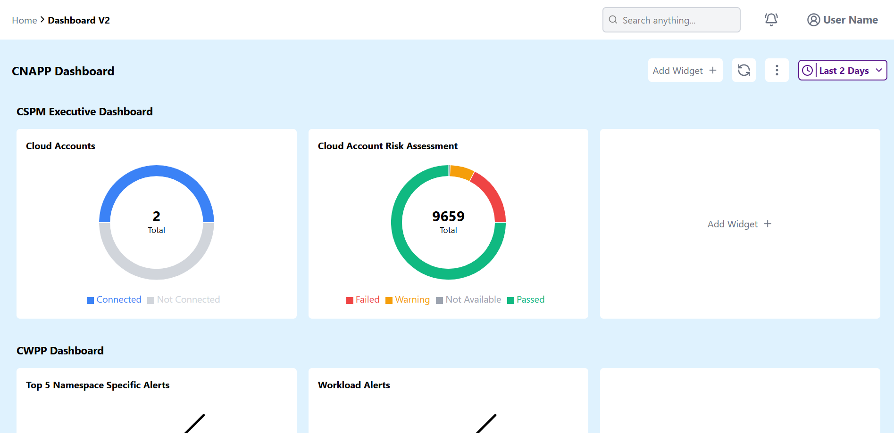
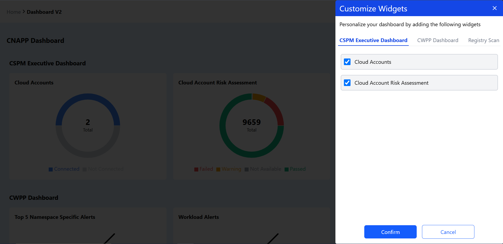

# CNAPP Dashboard

A customizable Cloud Native Application Protection Platform dashboard built with React and Redux. Users can add, remove, and customize widgets across different security categories to create personalized monitoring views for their cloud environments.

[View Live Demo](https://cnapp-dashboard-project.vercel.app/)

## Screenshots

<div align="center">
  
  <p><em>Dashboard overview showing multiple security category sections</em></p>
  
  
  <p><em>Widget customization modal for creating personalized visualizations</em></p>
</div>

## Features

* **Customizable Dashboard:** Add, remove, and organize widgets based on security monitoring needs
* **Multiple Security Categories:**
  * CSPM Executive Dashboard - Cloud Security Posture Management metrics
  * CWPP Dashboard - Cloud Workload Protection Platform data
  * Registry Scan - Container image security analysis
* **Interactive Widgets:** Visualize security data through pie charts and text-based displays. (Note - Currently only text-based data can be added.)
* **Widget Management:** Full CRUD operations for dashboard widgets
* **Search Functionality:** Quickly find widgets by title
* **Responsive Design:** Works on desktop and mobile devices

## Tech Stack

* **Frontend:** ReactJs
* **Build Tool:** Vite
* **State Management:** Redux Toolkit
* **Styling:** Tailwind CSS
* **Charts:** Recharts
* **Icons:** Lucide React

## Installation

### Prerequisites

* Node.js (v16.0.0 or higher)
* npm, yarn, or pnpm

### Setup

1. **Clone the repository:**
   ```bash
   git clone https://github.com/Sustainer2020/CNAPP-Dashboard-Project.git
   cd CNAPP-Dashboard-Project
   ```

2. **Install dependencies:**
   ```bash
   npm install
   ```

## Usage

1. **Start development server:**
   ```bash
   npm run dev
   ```
   The development server will start and display the local URL in your terminal

2. **Using the dashboard:**
   * **Add widgets:** Click the "+" button in any category section
   * **Remove widgets:** Hover over a widget and click the "X" button
   * **Customize widgets:** Click on any widget to open the customization modal
   * **Search widgets:** Use the search bar to filter by title
   * **Reset dashboard:** Click "Reset" to restore default widgets

3. **Production build:**
   ```bash
   npm run build
   npm run preview  # Preview production build
   ```
   
## Project Structure

```
.
├── public/
│   └── vite.svg
├── src/
│   ├── assets/        # Images and static resources
│   ├── components/
│   │   ├── common/    # Reusable UI components
│   │   ├── dashboard/ # Dashboard-specific components
│   │   ├── modals/    # Modal dialogs
│   │   └── navbar/    # Navigation components
│   ├── data/          # Mock data sources
│   ├── store/         # Redux store configuration
│   ├── App.jsx        # Main application component
│   └── main.jsx       # Application entry point
├── index.html
└── package.json
```
